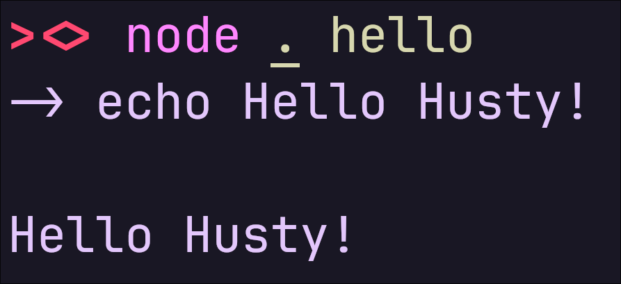
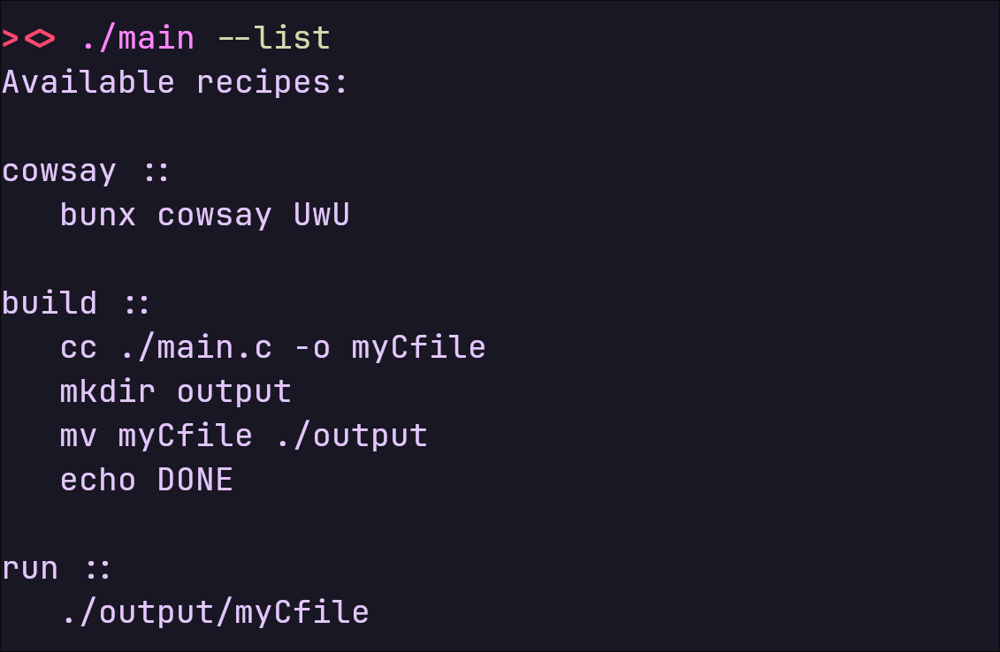

# Hust

A stupid parser in JavaScript to run project specific commands with ease.

**Hust is just a small project of mine.**

### Examples

Hust works like a Makefile works,

- You need a `hustfile` in your project directory.
- You create commands *(known as recipes)*.
- You run the command as positional argument.

### Syntax

You write in this way:

```
NAME::
 COMMAND
```

**Notes:**

- Name cannot contain [0-9] at first letter
- After name you assign it with double colon **::**
- Commands are written in new line
- A Command must start with at least one space

**Here is an example**

```
# in the hustfile

hello ::
   echo Hello Husty!
```

Then run it with positional argument

```bash
# since index.js is the default

node . hello

# or with npm
npm run hust hello

# or pnpm
pnpm hust hello
```



#### You can see the recipes that are in hustfile

```bash
pnpm hust -l
# or
pnpm hust --list
```


